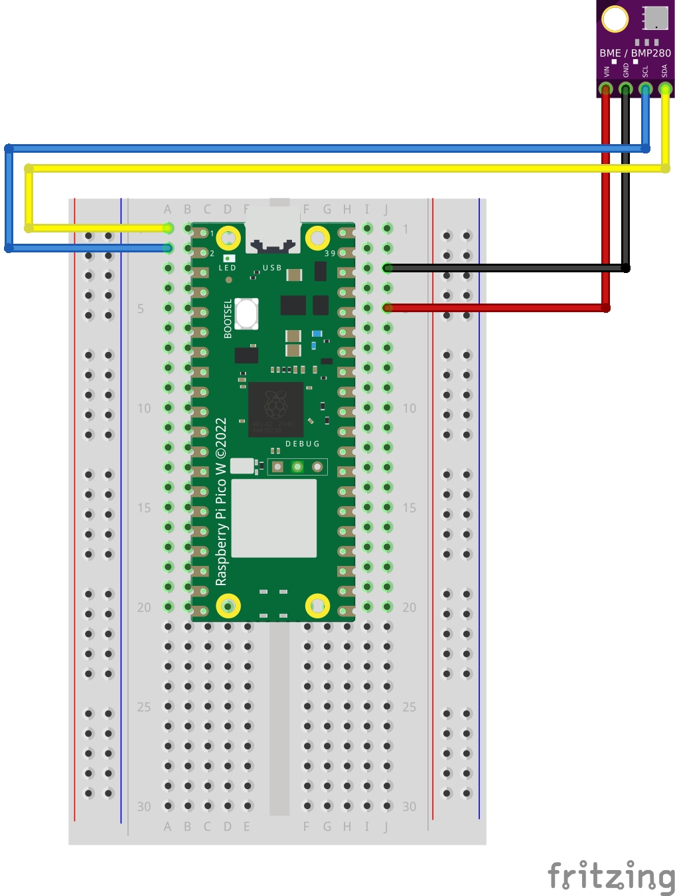

# BMP/BMP280 Micropython and pinout for Raspberry Pi Pico W

##  Sensor Sensor

### Outputs

 - Temperature °C
 - Temperature °F
 - Humidity %
 - Pressure mPA
 - Pressure mmHg

### Install prerequisites

- Micropython (tested with v1.22.0)
- micropython-bme280 (tested with v2.1.3) 

### Parts needed

- Raspbare Pi Pico (W)
- BME/BMP280 sensor
- Wires
- Breadbord (optional)

### Instructions

- Install <b>micropython_bme280</b> driver from Packages Manager (use Thonny)
- Copy the file <b>main_bme280.py</b> on your Raspberry Pi Pico
- Wire the parts as show in diagram below 

### Pinout

Vin -> VBUS (red)  
GND -> GND (black)  
SCL -> GP1 (grey)  
SDA -> GP0 (yellow)  
  
### Wiring Diagram

