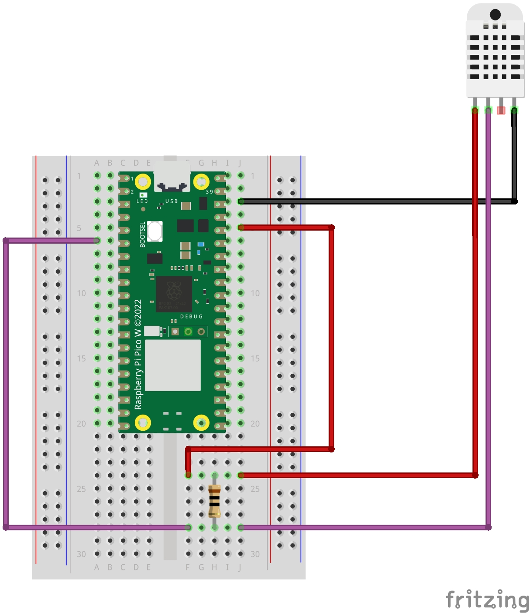

# DHT22 Micropython and pinout for Raspberry Pi Pico W

## Temperature and Humidity Sensor

### Outputs

 - Temperature °C
 - Temperature °F
 - Humidity %

### Install prerequisites

- Micropython (tested with v1.22.0)
- DHT driver (tested with v0.1.0)

### Parts needed

- Raspbare Pi Pico (W)
- DHT22 sensor
- 10k resistor
- Wires
- Breadbord (optional)

### Instructions

- Install <b>dht</b> driver from Packages Manager (use Thonny)
- Copy the file <b>main_dht22.py</b> on your Raspberry Pi Pico
- Wire the parts as show in diagram below 

### Pinout

Vin -> VBUS (red)  
GND -> GND (black)  
DATA -> GP6 (purple)  

### Wiring Diagram

