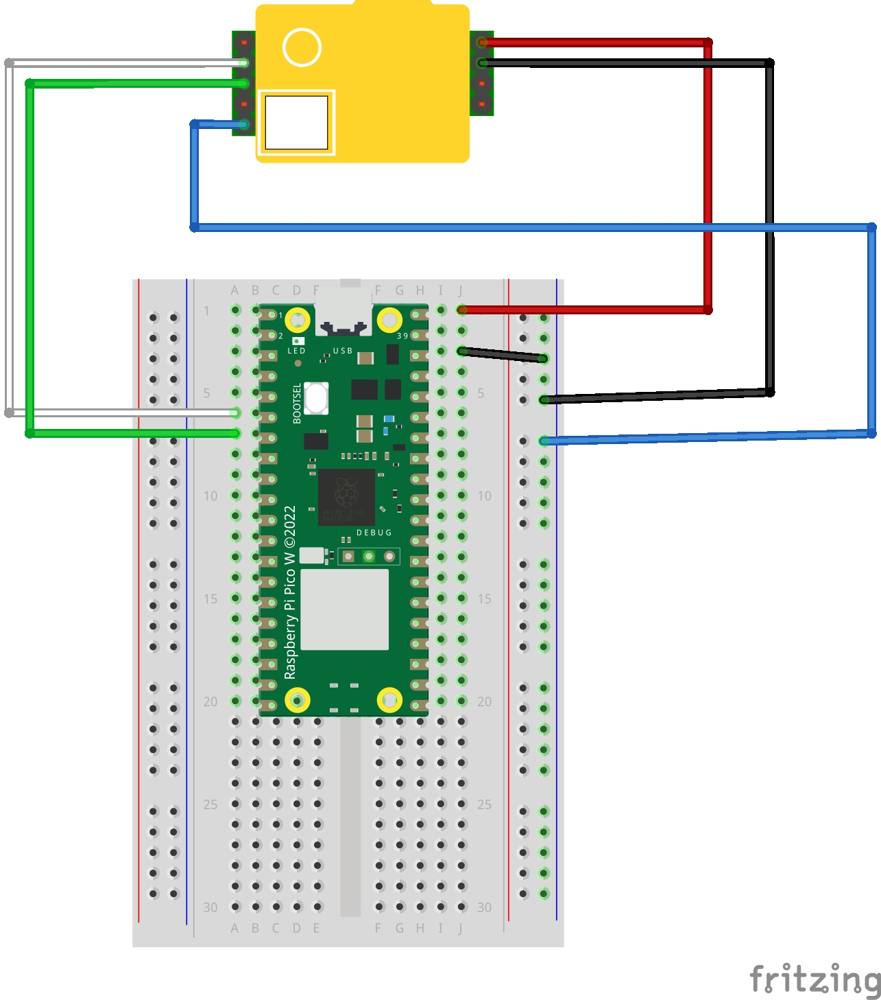
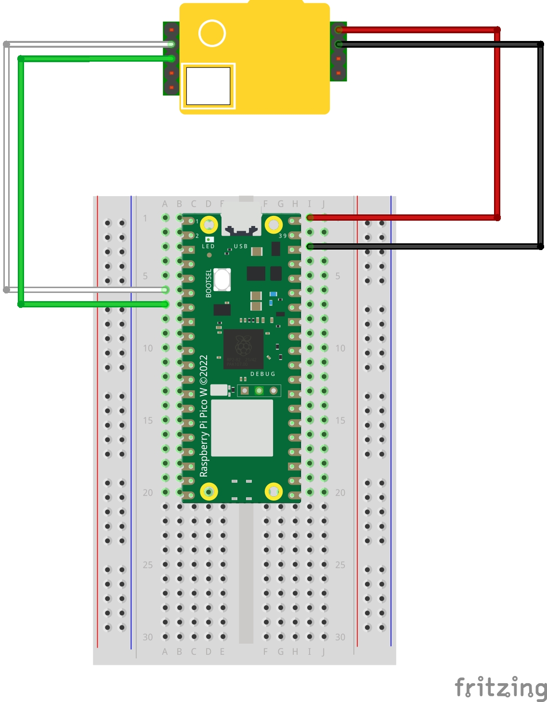

# MH-Z19 CO2 Sensor with MicroPython on Raspberry Pi Pico W

This guide provides detailed instructions on using the MH-Z19 CO2 sensor with the Raspberry Pi Pico W, programmed with MicroPython.

## Overview

The MH-Z19 is an infrared type CO2 sensor, capable of measuring CO2 concentration in air. It is suitable for indoor air quality monitoring, HVAC systems, and other environmental monitoring projects.

### Key Features

- **Measurement Range**: 400 ppm to 5000 ppm
- **Interfaces**: UART, PWM
- **Accuracy**: ±(50ppm + 5% of reading)

## Prerequisites

- MicroPython installed on Raspberry Pi Pico W - tested with v1.22.0

## Parts Needed

- Raspberry Pi Pico W
- MH-Z19 CO2 Sensor
- Connecting Wires
- Breadboard (Optional for easier prototyping)

## Sensor Calibration

- Calibrate the MH-Z19 sensor in an environment with a known CO2 concentration.
- Fresh outdoor air, typically at 400 ppm, is ideal for standard calibration.
- Calibration ensures accuracy and compensates for long-term drift.

### Sensor Warm-Up

- Allow a warm-up time of **3 minutes** when powering on the sensor for the first time or after a prolonged period of being off.
- This period allows the sensor to reach a stable operating state for accurate measurements.

### Calibration Procedure

- **Software Calibration**: Uncomment the line `mhz19.calibrate()` in `main_mhz19.py` and execute the script to perform zero-point calibration.
- **Hardware Calibration**: The zero point calibration process can be also initiated simply by connecting <b>HD</b> and <b>GND</b> together for a duration of 7 seconds, as illustrated in the image below.

### Calibration Considerations

- Avoid calibrating in polluted or enclosed areas where CO2 levels might be elevated.
- Periodic calibration is recommended to maintain measurement accuracy.

## Setup Instructions

### Copying Files

1. Transfer `main_mhz19.py` and `lib/mhz19.py` to your Raspberry Pi Pico W.
2. Ensure that the file paths are maintained as mentioned.

### Wiring Setup

Connect the MH-Z19 sensor to the Raspberry Pi Pico W as follows:

- **Vin**: Connect to VBUS (Red wire)
- **GND**: Connect to GND (Black wire)
- **TX**: Connect to GP4 (Green wire)
- **RX**: Connect to GP5 (White wire)

### Wiring Diagram

Refer to the wiring diagram below for a visual guide on connecting the MH-Z19 sensor to the Raspberry Pi Pico W.

