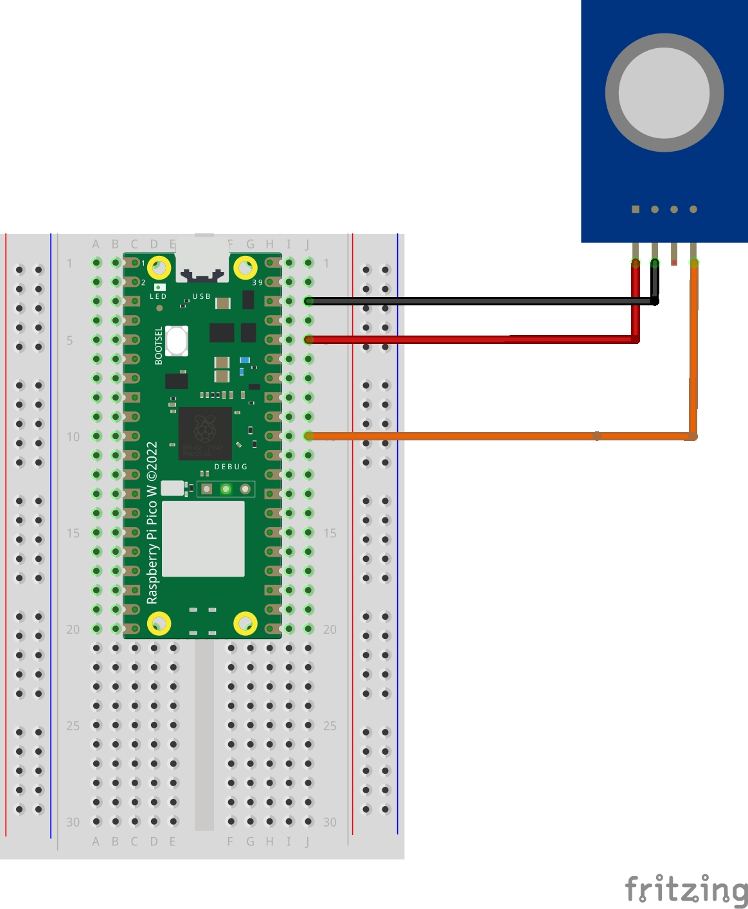

# MQ-2 Micropython and pinout for Raspberry Pi Pico W

## Gas/Smoke Sensor

### Outputs

- Smoke / ppm
- LGP (Liquefied petroleum gas) / ppm
- Methane / ppm
- Hydrogen / ppm 

### Install prerequisites

- Micropython (tested with v1.22.0)

### Parts needed

- Raspbare Pi Pico (W)
- MQ-2 sensor
- Wires
- Breadbord (optional)

### Instructions

- Copy both files (<b>main_mq2.py</b> and <b>lib/basemq.py</b>) on your Pi Pico keeping the paths
- Wire the parts as show in diagram below 

### Pinout

Vin -> VBUS (red)  
GND -> GND (black)  
A0 -> GP26 (orange)  

### Wiring Diagram

#### Copied from peppe8o & Alexey Tveritinov
 - https://peppe8o.com/mq-2-with-raspberry-pi-pico-gas-sensor-wiring-and-micropython-code/
 - https://github.com/amperka/TroykaMQ
  

