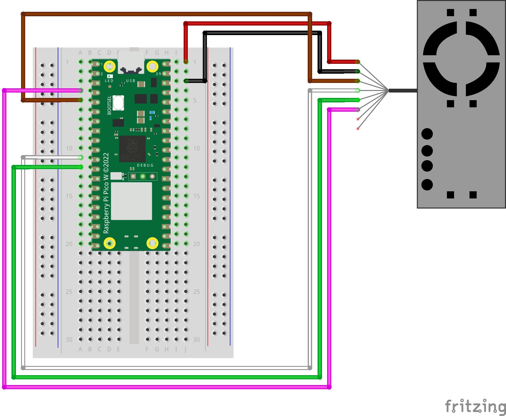

# PMS5003 Micropython and pinout for Raspberry Pi Pico W

## Particulate Matter Sensor

### Install prerequisites

- Micropython (tested with v1.20.0)
- pms5003-micropython (tested with v0.0.7) 

### Pinout

Vin -> VBUS (red)  
GND -> GND (black)  
SET -> GP3 (grey)  
TX  -> GP9 (yellow)  
RX  -> GP8 (blue)  
RESET -> GP4 (white)  

